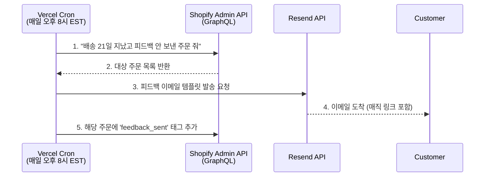

# 💌 피드백 자동화 파이프라인 공식 문서 (Documentation)

> **작성일:** 2026-04-28  
> **목적:** 서울 스낵박스를 구매한 고객에게 배송 완료 21일 후, 자동으로 피드백 요청 이메일을 발송하여 리뷰를 수집하고 $5 할인 쿠폰을 제공하여 재구매율(AOV)을 높입니다.

---

## 🏗️ 1. 아키텍처 개요 (Architecture)

이 시스템은 서버 비용을 최소화(100% 무료)하고 관리를 단순화하기 위해 **"서버리스 스케줄러(Vercel Cron) + API 직접 조회"** 방식을 사용합니다. 별도의 데이터베이스(Supabase)나 복잡한 Webhook 설정이 필요 없습니다.



---

## ⚙️ 2. 작동 원리 (How it works)

1. **스케줄링:** `vercel.json`에 정의된 대로, Vercel 서버가 매일 정해진 시간(UTC 01:00 / EST 20:00)에 `app/api/cron/send-feedback/route.ts` API를 스스로 호출합니다.
2. **Shopify 조회:** 코드가 Shopify Admin GraphQL API를 호출하여 다음 조건에 맞는 주문(최대 50건)을 가져옵니다.
   - 상태가 배송 완료(`fulfilled_status:fulfilled`)인 주문
   - `feedback_sent` 태그가 **없는** 주문 (중복 발송 방지용)
   - 배송 완료일(`fulfillment.createdAt`)이 오늘로부터 **21일 이상 지난** 주문
3. **이메일 발송:** 조건에 맞는 주문의 고객 이메일 주소로 Resend를 통해 `FeedbackEmail.tsx` React 컴포넌트를 렌더링하여 발송합니다.
4. **상태 업데이트:** 이메일 발송이 성공하면, Shopify의 해당 주문에 `feedback_sent`라는 태그를 자동으로 달아줍니다. 내일 Cron이 다시 돌 때 이 주문은 필터링되어 제외됩니다.

---

## 📂 3. 핵심 파일 (Key Files)

이 자동화 시스템은 딱 **3개의 파일**로만 구성되어 있어 유지보수가 매우 쉽습니다.

| 파일 경로 | 역할 |
|-----------|------|
| `vercel.json` | Vercel에게 Cron Job을 몇 시에 실행할지(`0 1 * * *`) 알려주는 설정 파일 |
| `app/api/cron/send-feedback/route.ts` | 자동화의 "뇌" 역할을 하는 실제 코드. Shopify 데이터 조회, 조건 필터링, 이메일 발송, 태그 추가 로직이 모두 들어있습니다. |
| `emails/FeedbackEmail.tsx` | 고객이 받아보는 이메일의 디자인(UI) 템플릿 파일입니다. React 코드로 짜여 있어 수정이 쉽습니다. |

---

## 🔑 4. 필수 환경 변수 (Environment Variables)

이 시스템이 정상적으로 작동하려면 Vercel 환경 변수 세팅에 다음 항목들이 모두 있어야 합니다.

| 변수명 | 용도 | 획득처 |
|--------|------|--------|
| `SHOPIFY_CLIENT_ID` | Shopify API 통신용 ID | Shopify Admin > Custom Apps |
| `SHOPIFY_CLIENT_SECRET` | Shopify API 통신용 비밀키 | Shopify Admin > Custom Apps |
| `NEXT_PUBLIC_SHOPIFY_STORE_DOMAIN` | 내 스토어 주소 (xxx.myshopify.com) | Shopify Admin |
| `RESEND_API_KEY` | 이메일 발송 API 키 | Resend 대시보드 |
| `NEXT_PUBLIC_SITE_URL` | 피드백 폼으로 가는 매직 링크 도메인 | 실제 도메인 (`https://seoulsnackbox.com` 등) |
| `CRON_SECRET` | 스케줄러 보안용 비밀키 | **(Vercel이 자동 생성함)** |

---

## 🛠️ 5. 테스트 및 유지보수 방법

### 수동으로 테스트해보고 싶을 때
로컬 환경에서는 Cron 스케줄과 상관없이 브라우저나 Postman에서 아래 주소로 접속하면 즉시 강제로 코드를 실행해 볼 수 있습니다.
- `http://localhost:3000/api/cron/send-feedback`

> **주의:** 로컬 테스트 시에는 진짜로 Shopify 데이터를 조회하고 메일을 발송해 버립니다. Vercel(프로덕션) 환경에서는 `CRON_SECRET` 검증 로직 때문에 일반 접속이 차단됩니다.

### 이메일 발송 대기 기간을 바꾸고 싶을 때
현재 21일 뒤에 보내도록 설정되어 있습니다. 이 기간을 수정하려면 `app/api/cron/send-feedback/route.ts` 파일의 아래 코드를 찾아서 숫자를 수정하세요.

```typescript
// 3. 21일 이상 전에 배송된 주문만 필터링
const cutoffDate = new Date();
cutoffDate.setDate(cutoffDate.getDate() - 21); // <--- 이 숫자(21)를 변경
```

### 이메일 디자인을 바꾸고 싶을 때
`emails/FeedbackEmail.tsx` 파일을 수정하시면 됩니다. 텍스트 수정, 문구 변경, 할인율 변경 등을 여기서 할 수 있습니다.

---

## 🚨 자주 묻는 질문 (Troubleshooting)

**Q: 이메일이 두 번 가면 어떡하죠?**
A: 안심하세요. 메일을 성공적으로 발송한 직후, Shopify 해당 주문 내역에 `feedback_sent`라는 꼬리표(Tag)를 붙입니다. 우리 코드는 이 꼬리표가 붙은 주문은 절대 다시 건드리지 않습니다.

**Q: Vercel에서 `401 Unauthorized` 에러가 나요!**
A: Vercel 대시보드의 환경 변수에 `CRON_SECRET`이 제대로 생성되어 있는지 확인하세요. 만약 누락되었다면, Vercel 프로젝트 설정의 Cron 메뉴에서 시크릿을 재발급받을 수 있습니다.
