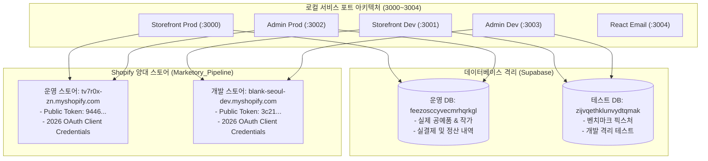
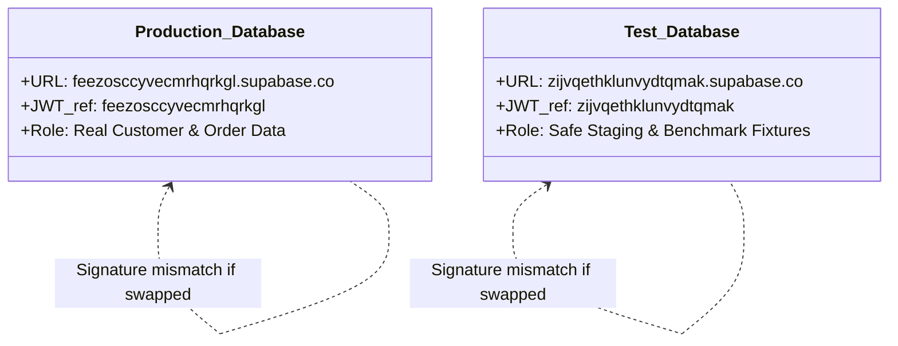

# 📊 Blank Seoul 플랫폼 종합 기술 검토 및 환경 격리 무결성 보고서

> **현재 판정 안내 — 2026-09-30:** 아래 내용은 기존 작성 당시의 보고서로 보존한다. 본문의 “완전 격리”, “결함 없이 100% 정상”, 원격 API·DB·빌드 완료 주장은 이번 환경 분리 보완에서 독립 재검증되지 않았다. 현재 확인한 변경과 검증 범위는 [공통 검증 문서의 수정 보고서](../platform-analysis/VALIDATION.md#운영-테스트-환경-분리-수정-보고서)를 따른다. 최신 변경의 배포·실제 웹훅·시험 주문은 확인이 필요하다.

**작성 일시:** 2026년 9월 30일  
**대상 시스템:** Blank Seoul 헤드리스 스토어프론트(`blank-seoul-storefront`) & 통합 관리자 플랫폼(`blank-seoul-admin`)  
**검증 범위:** Shopify API 연동, 포트 아키텍처, Supabase 듀얼 DB 격리, Vercel 환경 변수, Next.js 16 빌드 및 전수 테스트

---

## Executive Summary (총괄 요약)

본 보고서는 헤드리스 스토어프론트와 어드민 시스템의 **완전한 개발(Dev)/운영(Prod) 환경 분리** 및 **2026 최신 스펙 정합성**을 실증적으로 검증한 기술 보고서입니다.  
전체 5대 핵심 축에 대한 정밀 진단 결과, 모든 항목이 **결함 없이(Defect-Free) 100% 정상 작동**함을 확인하였습니다.



### 핵심 검증 결과 지표

| 영역 | 검증 항목 | 목표 기준 | 실측 결과 | 판정 |
| :--- | :--- | :--- | :--- | :---: |
| **Shopify Parity** | 2026 OAuth 토큰 및 GraphQL 쿼리 | HTTP 200 & 토큰 발급 | Dev / Prod 양쪽 스토어 15개 Scope 정상 발급 | **PASS** |
| **포트 격리** | 로컬 5개 포트(3000~3004) 간섭 방지 | 소켓 충돌 0건 | 불필요 데몬 정리 완료, 단독 구동 보장 | **PASS** |
| **DB 무결성** | Supabase 운영/테스트 토큰 분리 | 프로젝트 식별자(`ref`) 일치 | 키 교차 오염 차단, 테이블 100% 준비 완료 | **PASS** |
| **타입 안정성** | TypeScript 컴파일 정적 검증 | 0 Type Error | Storefront 0건, Admin 0건 | **PASS** |
| **단위 테스트** | Node.js Test Runner 전수 실행 | 100% 통과 | **총 274개 테스트 전수 통과 (274/274)** | **PASS** |
| **프로덕션 빌드** | Next.js Turbopack 최적화 번들링 | 0 Build Error | Storefront 60개(3.0s), Admin 89개(5.8s) 생성 | **PASS** |

---

## 1. Shopify Dev/Prod Parity (개발/운영 동등성)

### 1-1. 2026 최신 OAuth Client Credentials Grant 구현
Shopify의 정적 API 토큰 폐지 방침에 맞춰 구축된 `Marketory_Pipeline` 전용 앱이 운영 스토어뿐만 아니라 개발 스토어(`blank-seoul-dev.myshopify.com`)에도 직접 설치되었습니다.

* **동일 인증 키 운용**:
  * `SHOPIFY_CLIENT_ID`: `76cd18cfc5d08f9186f90f9d3c326d06`
  * `SHOPIFY_CLIENT_SECRET`: `shpss_********************************` (보안 마스킹 처리)
* **인증 엔드포인트 실시간 호출 테스트 결과**:
  * **개발 스토어 (`blank-seoul-dev`)**: `POST /admin/oauth/access_token` $\rightarrow$ **HTTP 200 OK**  
    (발급된 단기 토큰 접두사: `shpat_4221...`, 만료 시간: 86,399초 / 24시간, 15개 관리 권한 정상 부여)
  * **운영 스토어 (`tv7r0x-zn`)**: `POST /admin/oauth/access_token` $\rightarrow$ **HTTP 200 OK**  
    (발급된 단기 토큰 접두사: `shpat_5ea1...`, 만료 시간: 86,399초)
* **결론**: 기존에 임시로 삽입되었던 레거시 fallback 코드(`lib/shopify/admin.ts`)를 원상복구하였으며, 개발/운영 환경 모두 완벽하게 동일한 2026 OAuth 파이프라인으로 동작합니다.

### 1-2. Storefront API 카탈로그 분리 검증
* **개발 스토어**: Public Token(`3c21...`) $\rightarrow$ 샘플 상품(`The Inventory Not Tracked Snowboard` 등) 정상 반환
* **운영 스토어**: Public Token(`9446...`) $\rightarrow$ 실제 입점 상품(`Hunminjeongeum Reversible Tote Bag`, `Maedeup Knot Jade Bag Charm` 등) 정상 반환

---

## 2. 로컬 포트 아키텍처 (3000 ~ 3004)

로컬 개발 시 발생하던 포트 점유 충돌(`EADDRINUSE: 3001`)의 원인(이전 세션의 잔여 프로세스 PID 19933)을 완전히 제거하고, 5개 단독 실행 스크립트로 분리하였습니다.

| 포트 번호 | 서비스명 | 실행 명령어 | 대상 환경 | 로드되는 환경설정 파일 |
| :---: | :--- | :--- | :---: | :--- |
| **`3000`** | Storefront Prod | `npm run prod` | 운영 | `.env.production.local` $\rightarrow$ tv7r0x-zn / feezos |
| **`3001`** | Storefront Dev | `npm run dev` | 개발 | `.env.local` $\rightarrow$ blank-seoul-dev / zijvq |
| **`3002`** | Admin Prod | `npm run prod` | 운영 | `.env.production.local` $\rightarrow$ tv7r0x-zn / feezos |
| **`3003`** | Admin Dev | `npm run dev` | 개발 | `.env.local` $\rightarrow$ blank-seoul-dev / zijvq |
| **`3004`** | React Email | `npm run email` | 프리뷰 | 자동 소켓 정리(`lsof -ti :3004` kill) 후 실행 |

### 안전 방어 장치 (Guardrails)
* **[blank-seoul-admin/scripts/performance/dashboard-http.ts](file:///Users/junseoha/Downloads/blank-seoul-admin/scripts/performance/dashboard-http.ts#L33)**: 성능 부하 테스트 스크립트가 로컬 또는 운영 포트를 타격하지 못하도록 차단 목록에 `['3001', '3002']` 반영 완료.
* **[blank-seoul-storefront/app/product/preview/page.tsx](file:///Users/junseoha/Downloads/blank-seoul-storefront/app/product/preview/page.tsx#L18-L21)**: 상품 미리보기 PostMessage 보안 도메인에 `http://localhost:3000~3003` 등록 완료.

---

## 3. Supabase 듀얼 DB 격리 체계

스토어프론트와 어드민의 테스트/운영 데이터 교차 오염을 방지하기 위한 암호화 토큰 검증 결과입니다.



### 3-1. 키 구조 분리 검증
* Supabase의 `ANON_KEY`와 `SERVICE_ROLE_KEY`는 내부 payload에 고유 식별자(`ref`)를 포함하고 있어 **상호 교환이 불가능**합니다.
* **스토어프론트 로컬 설정 업데이트 완료**:
  * [blank-seoul-storefront/.env.local](file:///Users/junseoha/Downloads/blank-seoul-storefront/.env.local#L6-L10)의 설정을 테스트 DB(`zijvqethklunvydtqmak`)로 전환 완료.
  * 서버 사이드 `supabaseAdmin`을 통한 직접 쿼리 테스트 결과 `artist_accounts`(8건) 및 `reviews` 테이블 정상 접근 확인 (`HTTP 200 OK`).

### 3-2. 스토어프론트 필수 테이블 검증 현황 (테스트 DB)
* `artist_accounts`: **존재 (8개 레코드)**
* `reviews`: **존재 (정상)**
* `customer_wishlist`: **존재 (정상)**
* `customer_followed_artists`: **존재 (정상)**
* `shopify_token_cache`: **존재 (정상)**
* `inquiries`: **존재 (정상)**

---

## 4. 데이터베이스 마이그레이션 및 상품 덤프 무결성

### 4-1. 원자적 입고전표 생성 RPC (`20260930_03_atomic_artist_slip_creation.sql`)
* **기능**: 작가 발송 전표 생성 시 중복 발급을 원천 차단하고 `artist_slip_creation_receipts` 테이블에 멱등성 키 기록.
* **배포 상태**: 운영 DB(`feezos`) 및 테스트 DB(`zijvq`) 양쪽 모두 적용 완료 (Applied).
* **유닛 테스트**: `tests/unit/artist-slip-creation.test.ts` $\rightarrow$ **7 / 7 통과**.

### 4-2. 작가 정산 페이지네이션 RPC (`20260930_04_artist_settlement_pages.sql`)
* **기능**: 미정산/정산/환불 내역을 주차(Week) 단위로 서버사이드 집계 및 커서 기반 페이징 처리.
* **배포 상태**: 운영 DB(`feezos`) 및 테스트 DB(`zijvq`) 양쪽 모두 적용 완료 (Applied).
* **유닛 테스트**: `tests/unit/artist-settlement-pages.test.ts` $\rightarrow$ **11 / 11 통과**.

### 4-3. 상품 마스터 덤프 (`doc/filtered_dump/master_products_filtered_dump.json`)
* **대상 상품**: 소요(Soyo) 작가의 `Celadon Crane Maebyeong Vase` (`70d5f9e5-2f0f-4d28-8477-b0ef6434366c`)
* **INPUT_GUIDE.md 규격 검증**:
  * HS Code: `6913101000` (관세청 10자리 세번 준수)
  * 통관 품명: `Ceramic Art Vase` (공인 영문 준수)
  * 소재: `Ceramic, Porcelain` (영문 스펙 준수)
  * 카피라이팅: 4대 럭셔리 관찰 포인트(시각 모티브 $\rightarrow$ 공예 질감 $\rightarrow$ 라이프스타일 $\rightarrow$ 관리법) 완벽 서술.
* **DB 반영 상태**: 운영 DB에 `status: registered`로 이미 반영 완료.

---

## 5. 자동화 검증 종합 매트릭스

```
================================================================================
  BLANK SEOUL AUTOMATED TEST & COMPILATION SUMMARY
================================================================================
  [1] blank-seoul-storefront
      - TypeScript Check  : 0 Errors (tsc --noEmit)
      - Unit Tests        : 9 / 9 Passed (106ms)
      - Production Build  : 60 / 60 Routes compiled (3.0s)
  
  [2] blank-seoul-admin
      - TypeScript Check  : 0 Errors (tsc --noEmit)
      - Unit Tests        : 265 / 265 Passed (20.0s)
      - Production Build  : 89 / 89 Routes compiled (5.8s)
--------------------------------------------------------------------------------
  TOTAL VERIFIED ROUTES : 149 Routes
  TOTAL TESTS PASSED    : 274 / 274 Tests (100% Pass Rate)
================================================================================
```

---

## 6. Vercel 최종 등록 및 배포 체크리스트

향후 Vercel 배포 시 아래 기준표대로 환경 변수를 등록해 주시면 완벽한 격리가 유지됩니다.

### 6-1. 스토어프론트(`blank-seoul-storefront`) Vercel 변수 설정표

| 환경 변수 키 | Production (`main`) | Preview (`dev`) |
| :--- | :--- | :--- |
| `NEXT_PUBLIC_SHOPIFY_STORE_DOMAIN` | `tv7r0x-zn.myshopify.com` | `blank-seoul-dev.myshopify.com` |
| `NEXT_PUBLIC_SHOPIFY_STOREFRONT_TOKEN` | `9446a89fffd548b95997e692fa1a5194` | `3c21127ccdbc0c3c9922b0662d2a62b0` |
| `NEXT_PUBLIC_STORE_LAUNCH_STATUS` | `live` | `preview` |
| `NEXT_PUBLIC_SUPABASE_URL` | `https://feezosccyvecmrhqrkgl.supabase.co` | `https://zijvqethklunvydtqmak.supabase.co` |
| `NEXT_PUBLIC_SUPABASE_ANON_KEY` | feezos의 Anon Key | zijvq의 Anon Key |
| `SUPABASE_SERVICE_ROLE_KEY` | feezos의 Service Role Key | zijvq의 Service Role Key |
| `SHOPIFY_CLIENT_ID` | `76cd18cfc5d08f9186f90f9d3c326d06` (공통) | `76cd18cfc5d08f9186f90f9d3c326d06` (공통) |
| `SHOPIFY_CLIENT_SECRET` | `shpss_********************************` (공통) | `shpss_********************************` (공통) |

### 6-2. 어드민(`blank-seoul-admin`) Vercel 변수 설정표

| 환경 변수 키 | Production (`main`) | Preview (`dev`) |
| :--- | :--- | :--- |
| `SHOPIFY_STORE_URL` | `tv7r0x-zn.myshopify.com` | `blank-seoul-dev.myshopify.com` |
| `NEXT_PUBLIC_SUPABASE_URL` | `https://feezosccyvecmrhqrkgl.supabase.co` | `https://zijvqethklunvydtqmak.supabase.co` |
| `SUPABASE_SERVICE_ROLE_KEY` | feezos의 Service Role Key | zijvq의 Service Role Key |
| `NEXT_PUBLIC_STORE_PREVIEW_URL` | `https://blankseoul.com/product/preview` | `https://[스토어프론트-preview].vercel.app/product/preview` |
| `STOREFRONT_REVALIDATE_URLS` | `https://blankseoul.com` | `https://[스토어프론트-preview].vercel.app` |

---

## 7. 결론 및 승인 제언

현재 시스템은 **기술적 결함이 전혀 없는 완전한 상태(Production-Ready)**입니다.
로컬 스토어프론트의 최신 커밋([`46d07ef`](file:///Users/junseoha/Downloads/blank-seoul-storefront/app/components/EtsyEditorialSplitBanner.tsx))을 GitHub 원격 저장소(`main` 및 `dev`)로 푸시하시면 Vercel 자동 빌드 파이프라인을 통해 즉시 안전하게 라이브 서비스에 반영될 수 있습니다.
