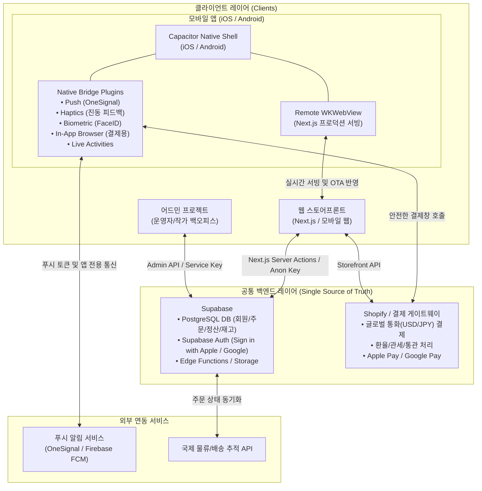

# Blank Seoul 모바일 앱 전략 및 시스템 아키텍처 설계서

> **문서 버전:** 1.1.0 (최신 트렌드 및 앱스토어 심사 방어 규정 반영)  
> **최종 수정일:** 2026-09-22  
> **상태:** 기획 및 기술 아키텍처 검토 완료 (Phase 1 웹 최적화 진행 중)  
> **대상 시스템:** Blank Seoul 스토어프론트(Next.js), 백엔드(Supabase), 어드민(Backoffice), 모바일 앱(iOS/Android)

---

## 1. 개요 및 배경

### 1.1 추진 배경
Blank Seoul은 글로벌 소비자를 대상으로 한국의 엄선된 K-Food 및 전통·현대 문화 상품을 직구/D2C 형태로 판매하는 플랫폼입니다.  
경쟁사인 '아이디어스 글로벌(idus Global)'과 같은 플랫폼과의 경쟁에서 우위를 점하고, 고객 획득 비용(CAC)을 낮추며 고객 생애 가치(LTV)를 극대화하기 위해 모바일 앱 확장 전략을 수립합니다.

### 1.2 아이디어스 글로벌(idus Global) 벤치마크 및 비교

| 비교 항목 | 아이디어스 글로벌 (idus Global) | Blank Seoul 모바일 전략 |
| :--- | :--- | :--- |
| **운영 모델** | 오픈마켓 / 마켓플레이스 나열식 | **엄선된 큐레이션 & 세일즈 퍼널 (Hook-Story-Offer)** |
| **진입 장벽** | 무조건 전용 앱 다운로드 요구 (이탈률 90%+) | **웹 퍼널로 1차 구매 완료 후, 유지(Retention) 단계에서 앱 유도** |
| **타깃 경험** | 수만 개 상품 중 직접 검색 (탐색 피로도 높음) | 감성적인 스토리텔링, 기획 세트, 원클릭 오퍼 결제 |
| **주요 역할** | 단순 상품 브라우징 창구 | **배송 추적, VIP 한정 드롭(Drop) 알림, 무료 푸시 마케팅 채널** |

---

## 2. 비즈니스 & 퍼널 전략 (Web-First, App-Retention & Phygital Onboarding)

러셀 브런슨(Russell Brunson)의 다이렉트 리스폰스 마케팅 원칙에 따라, **"앱을 통한 신규 고객 획득"은 지양**하고 **"웹을 통한 획득 + 언박싱(Phygital) 및 앱을 통한 팬덤/재구매 극대화"** 구조를 채택합니다.

```mermaid
flowchart LR
    Ad[글로벌 SNS 광고\n(Meta / TikTok)] --> WebFunnel[웹 세일즈 퍼널\n(Next.js 모바일 웹)]
    WebFunnel --> FirstPurchase[첫 구매 완료\n(원클릭 결제 / 앱 설치 불필요)]
    FirstPurchase --> ThankYou[주문 완료 & 이메일\n'배송 추적 안내']
    
    subgraph Phygital["피지컬-디지털(Phygital) 언박싱 순간 (가장 높은 전환율)"]
        BoxArrived[K-Food 박스 현지 도착] --> Unboxing[실물 박스 언박싱\n(도파민 피크)]
        Unboxing --> QRScan[동봉된 시크릿 레시피 & VIP 카드 QR 스캔]
    end
    
    ThankYou --> AppInstall[모바일 앱 설치\n(iOS / Android)]
    QRScan --> AppInstall
    
    AppInstall --> Retention[푸시 알림 / Live Activities 배송추적 / 시크릿 드롭\n재구매 LTV 극대화 (광고비 0원)]
```

### 2.1 퍼널 단계별 행동 목표
1. **Acquisition (신규 획득 - Web)**: 
   - 앱스토어 다운로드 강제 시 90% 이상 이탈 발생.
   - 모바일 최적화 웹(Next.js)에서 광고 클릭 즉시 1~2클릭으로 첫 결제를 완성.
2. **Onboarding 1단계 (주문 직후 - Thank You & Email)**:
   - 주문 완료 페이지(Thank You Page)와 배송 안내 이메일에 *"실시간 국제 항공 배송 상태를 확인하고, 다음 달 한정판 K-Food 박스 우선 구매권을 받으세요"* 훅(Hook)을 제공하여 1차 앱 설치 유도.
3. **Onboarding 2단계 (피지컬 언박싱 순간 - Phygital Loop)**:
   - **가장 강력한 앱 전환 포인트**: 해외 고객이 실물 K-Food 박스를 받고 언박싱할 때 동봉된 **"시크릿 레시피북 & VIP 앱 전용 15% 리오더 쿠폰 QR 카드"**를 스캔하여 앱을 설치하도록 유도.
4. **Retention (재구매 및 LTV 증대 - App)**:
   - 광고비 지출 없이 **앱 푸시 알림(Push Notification)** 및 **Live Activities**를 통해 시크릿 할인, 리오더(재구매), 신규 기획전 알림 발송.

---

## 3. 전체 시스템 아키텍처

현재 분리되어 운영 중인 **프론트엔드(Next.js), 백엔드(Supabase), 어드민(Backoffice)** 구조는 모바일 앱을 연동하기에 가장 이상적인 모던 헤드리스(Headless) 아키텍처입니다.

### 3.1 아키텍처 다이어그램



### 3.2 핵심 아키텍처 방식: Remote URL Wrapper + Native Bridge
* Next.js의 App Router, SSR(서버 사이드 렌더링), Server Actions 기능을 100% 온전히 유지하기 위해 정적 빌드(`output: 'export'`) 대신 **원격 프로덕션 URL 서빙(Remote URL Wrapper) 방식**을 채택합니다.
* **장점**:
  1. 웹 배포(Vercel 등) 시 **앱스토어 재심사 없이 앱 내 UI/UX가 즉시 실시간 업데이트(OTA)**됩니다.
  2. 서버 컴포넌트의 빠른 초기 로딩 및 SEO/OG 태그 구조를 그대로 공유합니다.
  3. 네트워크 단절 시에는 Capacitor 로컬에 내장된 '오프라인 네트워크 연결 안내 화면'이 즉시 노출되도록 안전장치를 구축합니다.

---

## 4. 결제(Checkout) 및 네이티브 최적화 전략

### 4.1 웹뷰 내 결제 세션 및 Apple Pay / Google Pay 호환성
* **문제점**: 모바일 웹뷰(`WKWebView`) 내부에서 직접 Shopify 체크아웃을 열 경우, Apple Pay 버튼이 비활성화되거나 결제 세션/보안 쿠키가 차단될 수 있습니다.
* **해결 방안 (In-App Browser 연동)**:
  - 장바구니에서 'Checkout' 버튼 클릭 시, Capacitor 플러그인(`@capacitor/inappbrowser` 또는 `SFSafariViewController` / `Chrome Custom Tabs`)을 통해 안전한 시스템 브라우저 세션으로 체크아웃 URL을 오픈합니다.
  - **효과**: 해외 고객의 사파리에 등록된 **네이티브 Apple Pay / Google Pay 1-클릭 결제가 100% 완벽하게 동작**하며, 결제 완료 후 딥링크(`blankseoul://checkout-success`)를 통해 앱의 주문 완료 화면으로 부드럽게 복귀합니다.

---

## 5. 앱 전용 핵심 기능 명세

1. **글로벌 푸시 알림 (Push Notifications)**:
   - **OneSignal / Firebase FCM** 기반 국가별 시차(Timezone) 맞춤 발송.
   - 장바구니 미결제 이탈자 복구 알림, 한정판 K-Food 박스 시크릿 드롭 알림.
2. **Live Activities & 다이내믹 아일랜드 (iOS 최신 트렌드)**:
   - 해외 직구 고객의 가장 큰 불안 요소인 배송 단계를 잠금화면과 다이내믹 아일랜드에 실시간 시각화.
   - 상태 진행: `[인천공항 패킹 완료] ➔ [국제 항공 운송 중 ✈️] ➔ [현지 세관 통관] ➔ [집 앞 배송 중 📦]`.
3. **햅틱 피드백 (Haptics)**:
   - 장바구니 담기, 오퍼 선택, 버튼 탭 시 미세한 네이티브 진동 피드백(`@capacitor/haptics`)을 제공하여 **"웹사이트가 아닌 진짜 프리미엄 앱"**의 손맛 제공.
4. **생체 인증 및 Sign in with Apple**:
   - Face ID / Touch ID를 통한 간편 로그인.
   - Supabase Auth를 통한 원클릭 소셜 로그인 지원.
5. **유니버설 링크 / 딥링크 (Deep Linking)**:
   - 이메일/SNS에서 `blankseoul.com/products/k-food-box-1` 클릭 시, 앱이 설치된 유저는 앱 내 해당 상품 뷰로 즉시 다이렉트 오픈.

---

## 6. 앱스토어(Apple/Google) 심사 및 정책 방어 가이드 (2026 최신)

모바일 앱스토어 론칭 시 리젝을 사전에 완벽히 차단하기 위한 필수 준수 규정입니다.

### 6.1 Apple App Store 가이드라인 대응

| 가이드라인 항목 | 애플 규정 내용 | Blank Seoul 대응 전략 |
| :--- | :--- | :--- |
| **4.2 최소 기능<br>(Minimum Functionality)** | 단순 웹사이트를 웹뷰로 감싸기만 한 앱은 등록 거절 (가장 빈번한 리젝 사유) | • 푸시 알림, 햅틱 피드백, Live Activities, FaceID 등 **네이티브 고유 기능 4가지 이상 탑재** 증명<br>• 오프라인 안내 화면 및 스플래시 화면 구현 |
| **3.1.5(a) 실물 상품<br>(Physical Goods)** | 음식, 공예품 등 실물 상품은 Apple IAP(30% 수수료) 대상 제외 | • **Shopify / Stripe 결제 게이트웨이 정당 사용**<br>• 애플 수수료 30% 면제 대상임을 심사 메모(Review Notes)에 명시 |
| **4.8 Sign in with Apple** | 타사 소셜 로그인(구글 등)을 제공하는 경우 Apple 로그인 필수 | • Supabase Auth에 **"Sign in with Apple"** 필수 활성화 및 로그인 화면에 최우선 배치 |
| **5.1.1 계정 삭제 규정** | 회원가입 기능이 있는 앱은 앱 내에서 즉시 탈퇴/계정 삭제가 가능해야 함 | • 마이페이지 내 '계정 삭제(Delete Account)' 기능 및 즉각적 개인정보 파기 로직 구현 |
| **Privacy Manifests<br>(iOS 17+ 필수 규정)** | 외부 SDK 사용 시 개인정보 수집 사유를 명시한 `PrivacyInfo.xcprivacy` 포함 필수 | • OneSignal, Firebase 등 설치된 SDK의 개인정보 보호 매니페스트 파일 필수 동봉 |

### 6.2 Google Play Store 규정 대응
* **Android 13+ 알림 런타임 권한**: 앱 실행 직후가 아니라, 첫 주문 완료 직후 "배송 추적 알림을 받으시겠습니까?" 맥락에서 `POST_NOTIFICATIONS` 권한 요청.
* **타깃 SDK 버전 준수**: 최신 Android API 레벨(Android 15+) 요구사항 준수.

---

## 7. 단계별 실행 로드맵 (Actionable Phases)

```
[Phase 1: 웹 모바일 UI/UX 및 세일즈 퍼널 최적화] (현재 단계)
  └ 모바일 반응형 완성, 1클릭 체크아웃 퍼널, Supabase 데이터 안정화, 언박싱 QR 카드 기획
        │
        ▼
[Phase 2: Capacitor 셸 & Native Bridge 구축]
  └ @capacitor/core 설치, iOS/Android 네이티브 프로젝트 생성, App Icon 및 Splash Screen 에셋 생성
        │
        ▼
[Phase 3: 네이티브 필수 기능 연동 & 심사 방어 구현]
  └ Sign in with Apple 연동, OneSignal 푸시 연동, Haptics 적용, SFSafari 결제창 연동, 계정 삭제 구현
        │
        ▼
[Phase 4: 스토어 제출 및 공식 론칭]
  └ Apple Developer ($99/년) & Google Play Console ($25) 계정 준비, 6개 언어 스크린샷 등록, 심사 제출
        │
        ▼
[Phase 5: Phygital 언박싱 & 리텐션 퍼널 가동]
  └ 실물 K-Food 박스에 QR 카드 삽입, 첫 구매자 대상 앱 설치 캠페인 개시, Live Activities 배송추적 활성화
```
