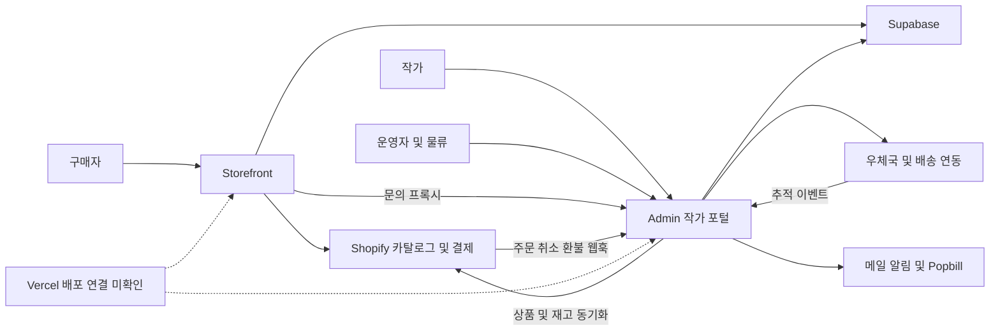

# 기능·업무 모듈 지도

2026-09-24 · F = storefront, A = admin. 아래는 실제 코드 경로에 근거한 논리적 모듈 분류다. 현재 폴더 구조를 바꾸거나 모든 기능을 검증했다는 뜻이 아니다. 전체 경로는 [소스 목록](SOURCE_INVENTORY.md)을 참고한다.

| 모듈 | 사용자 기능·화면 | 주요 실제 경로 | 검토 깊이·핵심 과제 |
| --- | --- | --- | --- |
| M01 계정·권한 | 고객 로그인·계정, 작가 인증, 운영자 로그인, 물류 세션 | F `app/account`, `app/auth/callback`, `lib/security/orderOwnership.ts`; A `proxy.ts`, `lib/security/*`, `lib/3pl/auth.ts` | 공통 가드와 대표 API·단위 시험 확인. 모든 엔드포인트·실제 RLS 격리는 미검증 |
| M02 작가·계약 | 가입·프로필·주소·은행/사업자 확인·이름 변경 | A `app/artist/join`, `app/api/artist/profile`, `verify-business`, `verify-bank-account`, `request-rename`, `lib/services/artistCascadeSync.ts` | 기능 목록화. 작가명 변경 시 거래·송장 식별자 영향, 탈퇴 후 거래 보존 추가 검토 |
| M03 상품·판매량 | 작가 상품 등록·옵션·재고 수정, 운영 승인·게시·분류·소싱·조달 | A `app/api/artist/products/*`, `artist/inventory/bulk`, `manage/approve-product`, `shopify/sync-*`, `lib/queue/*`, `lib/pricing/*`; `app/procurement`, `app/vendor/[token]` | 재고 수정·동기화 경로 확인. 소싱/조달은 별도 하위 업무로 분리해 후속 심화 필요 |
| M04 구매 경험 | 홈·작가·컬렉션·상품 상세·장바구니·Shopify 결제 연결 | F `app/page.tsx`, `app/artists`, `app/collections`, `app/product`, `app/cart`, `lib/shopify/api.ts`, `lib/shopify/storefront.ts` | 카탈로그 페이지네이션 단위 시험 확인. 브라우저 실제 구매·다국가/모바일 흐름 미검증 |
| M05 주문·조건 | 고객 주문 조회, 작가 수주·확인·발송 예정일·발송, 운영 주문 관리 | F `app/api/orders`, `track-order`; A `shopify/webhook/orders`, `artist/orders`, `admin/orders`, `lib/pipeline/modules/order-collector` | 수신·스냅샷·조회·상태 변경 조사. 두 종류 주문 레코드와 재수집 충돌 과제 |
| M06 물류 입고 | 스캔·검수·격리·입고 취소·재고 실사·수불부 | A `app/3pl/dashboard`, `api/3pl/inbound-sku`, `inventory`, `ledger`, `lib/3pl/inboundService.ts`, `lib/supabase/stock.ts` | 물류 SQL/RPC와 코드 조사. 주문별 누적 부분 입고·원자성 필요 |
| M07 출고·배송 | 합포장·선출고·우체국 접수·송장·패킹·배송 추적 | A `lib/3pl/orderGrouping.ts`, `epostService.ts`, `api/3pl/pack-complete`, `orders/split`, `api/webhooks/17track` | 그룹화 실제 함수 진단. 송장 확정 후 구성 변경·식별자 충돌 재현 |
| M08 취소·반품·환불 | 고객 취소 요청, Shopify 취소/환불 반영, 작가 반품 주소 | F `api/cancel-order`, `lib/shopify/admin.ts`; A `shopify/webhook/orders-cancel`, `refunds`, `lib/utils/settlement-check.ts` | 취소·환불 처리 조사. 작가 주소 필드는 있으나 반품 승인→라벨→수령 전체 연결은 미검증 |
| M09 정산·지급 | 미정산/지급 완료 조회·완료 표시·취소·내보내기·세금계산서 | A `app/settlement`, `api/admin/settlement`, `admin/orders` PATCH, `artist/settlements`, `admin/tax-invoices`, `lib/services/popbill` | 정산 근거·완료/취소 처리 조사. 실제 은행 이체 성공까지 자동화된 것으로 보지 않음 |
| M10 고객지원·성장 | 문의·첨부·번역, 리뷰·쿠폰·리마인더·뉴스레터·팔로우·찜·조회수 | F 관련 `app/api/*`, A `api/inquiries`, `api/artist/inquiries`, `api/manage/inquiries`, `lib/inquiries` | 문의 프록시·대표 보안 시험 확인. 전체 알림·쿠폰 중복 방지·보관 정책은 추가 검토 |
| M11 동기화·자동 작업 | 상품/재고 동기화, 주문 웹훅, 작가 알림, 외부 배송·세금 이벤트 | A `lib/queue`, `app/api/cron`, `lib/shopify/webhook-utils.ts`; F `api/cron`, `api/webhooks/resend`, `api/revalidate` | 서명·큐·재시도 경로 확인. 중단 작업 회수와 실제 스케줄 실행 증거 필요 |
| M12 운영·자동화 | Supabase·Vercel 설정, 오류 기록·백업·복구, agent-bridge | F/A 설정·SQL·스크립트; F `scripts/agent-bridge-front.mjs`; A `.github/workflows/fulfillment-pipeline.yml` | 로컬 설정 확인. 운영 프로젝트 상태·복구 훈련·다중 저장소 자동화는 미검증/미지원 |

## 기능 단위 등록부 — 2차 분석

사용자 여정은 [USER_JOURNEYS](USER_JOURNEYS.md)의 B/A/L/O/S 단계와 연결한다. 아래 35개 항목은 관리 목적의 기능 묶음이다. 각 묶음 안의 모든 API를 감사했거나 코드를 독립 모듈로 추출했다는 뜻은 아니다. API만 확인한 경로는 실제 화면 사용으로 확대하지 않았다.

**현재 사업 범위(D016):** 한국 제조 상품을 우선하고 K-Food는 보류한다. M07-F003의 식품 전용 PN 처리 등은 현재 출시 필수 여부를 별도로 표시할 대상이며, 공통 주문 분할·배송·통관 처리는 현재 상품에 필요한 범위를 검토한다. M03-F004의 벤더 발주도 K-Food 전용이라고 단정하지 않고 실제 상품 적용 범위를 확인한다. 아래 표는 존재하는 코드의 목록을 보존한다.

### M01–M04: 접근·입점·상품·구매

| 기능 ID | 책임·여정 | 실제 연결 근거 | 현재 판정·다음 확인 |
| --- | --- | --- | --- |
| M01-F001 | 고객 로그인·계정 — B04 | F [AuthProvider](../../app/components/AuthProvider.tsx) → [callback](../../app/auth/callback/route.ts) → `storefront_customers` | 이메일 OTP/Google 연결 확인; 주문 소유권·계정 전환 통합 미검증 |
| M01-F002 | 작가/운영자 인증·권한 — A01/O01 | A [artist 로그인](../../../blank-seoul-admin/app/artist/page.tsx), [proxy](../../../blank-seoul-admin/proxy.ts), [artistAuth](../../../blank-seoul-admin/lib/security/artistAuth.ts), [roles](../../../blank-seoul-admin/lib/security/roles.ts) | OAuth/작가 계정/관리자 경계 확인; 공개 가입·과거 인증 경로 포함 전수 점검 필요 |
| M01-F003 | 창고 계정·세션 — L01/O01 | A [계정 API](../../../blank-seoul-admin/app/api/manage/accounts-3pl/route.ts) → [3PL auth](../../../blank-seoul-admin/app/api/3pl/auth/route.ts) → [세션](../../../blank-seoul-admin/lib/3pl/auth.ts) | `accounts_3pl`/`tpl_sessions` 연결; 실제 창고 격리·회수 시험 필요 |
| M02-F001 | 작가 개설·운영 계정 관리 — A01/O01 | A [join](../../../blank-seoul-admin/app/artist/join/page.tsx) → [request-review](../../../blank-seoul-admin/app/api/artist/request-review/route.ts); [운영 화면](../../../blank-seoul-admin/app/manage/accounts-artist/page.tsx) | 현재 즉시 활성화. Q02와 함께 입점/상품 승인 구분 |
| M02-F002 | 공개 프로필·이름 변경 — A02/B01 | A [profile](../../../blank-seoul-admin/app/api/artist/profile/route.ts), [rename](../../../blank-seoul-admin/app/api/manage/artists/rename/route.ts) → F [artists](../../lib/artists.ts) | DB 공개 필드·Shopify vendor·slug 연결; 무상품 노출·개명 영향 Q03 |
| M02-F003 | 계정 종료·상품 보존 — A09/O01 | A [계정 삭제](../../../blank-seoul-admin/app/api/manage/artists/delete/route.ts), [계정 수정](../../../blank-seoul-admin/app/api/artist/create-account/route.ts) | 운영 경로 존재; 작가 직접 탈퇴·기존 거래/문의/환불 보존 전체 미검증 |
| M03-F001 | 상품 초안·옵션·이미지 — A03 | A [상품 wizard](../../../blank-seoul-admin/app/artist/dashboard/components/ProductWizardModal.tsx), [register](../../../blank-seoul-admin/app/api/artist/products/register/route.ts), [upload](../../../blank-seoul-admin/app/api/artist/upload/route.ts) | `master_products`/Storage 작성 경로. 단일/일괄 수정·동시 저장·파일 정리 확인 필요 |
| M03-F002 | 검수·분류·게시 — A04/O02 | A [submit](../../../blank-seoul-admin/app/api/artist/products/submit/route.ts) → [approve](../../../blank-seoul-admin/app/api/manage/approve-product/route.ts), [게시 hook](../../../blank-seoul-admin/app/manage/hooks/useShopifyPush.ts) → [publishProduct](../../../blank-seoul-admin/lib/shopify/publishProduct.ts) | 정산 정보 선행 조건과 승인/반려 확인; 승인·게시·실제 판매 가능 상태 대조 필요 |
| M03-F003 | 작가 가격·판매량 변경 — A05/B02/O02 | A [products hook](../../../blank-seoul-admin/app/artist/dashboard/hooks/useArtistProducts.ts) → [update](../../../blank-seoul-admin/app/api/artist/update/route.ts)/[inventory bulk](../../../blank-seoul-admin/app/api/artist/inventory/bulk/route.ts); F [stock](../../app/api/stock/route.ts) | 버전 검사·큐·외부 재고 조회 경로. 수량 책임 Q05/단가 효력 Q06 |
| M03-F004 | 소싱·발주·공급업체 — O06/S01 | A [procurement](../../../blank-seoul-admin/app/procurement/page.tsx) → [PO API](../../../blank-seoul-admin/app/api/procurement/purchase-orders/route.ts) → [auto-order](../../../blank-seoul-admin/lib/procurement/auto-order.ts); [vendor](../../../blank-seoul-admin/app/vendor/[token]/page.tsx) | 독립 공급 모델 후보. Q04 확정 전 작가 판매량과 동일 개념으로 합치지 않음 |
| M04-F001 | 작품·작가 탐색·조건 안내 — B01/B02 | F [home](../../app/page.tsx), [collections](../../app/collections/page.tsx), [상세](../../app/product/[handle]/page.tsx) → [catalog](../../lib/shopify/api.ts), [artists](../../lib/artists.ts) | 주요 읽기 연결 확인; 검색·국가별 조건·빈 목록·공개 범위는 세부 확인 필요 |
| M04-F002 | 장바구니·결제 이동 — B05 | F [CartProvider](../../app/components/CartProvider.tsx) → [useCartCheckout](../../app/cart/_hooks/useCartCheckout.ts) → Shopify cartCreate | 로컬 저장·복원·preview/live 분기 확인. 결제 성공/실패·쿠폰·재고 경합은 통합 미검증 |

### M05–M09: 주문·물류·취소·정산

| 기능 ID | 책임·여정 | 실제 연결 근거 | 현재 판정·다음 확인 |
| --- | --- | --- | --- |
| M05-F001 | 주문 수신·거래 조건 보존 — B05/O03 | A [주문 웹훅](../../../blank-seoul-admin/app/api/shopify/webhook/orders/route.ts), [order-manager](../../../blank-seoul-admin/lib/pipeline/shared/order-manager.ts) | `artist_orders`와 `orders`의 별도 생성 경로; Q06·PF01/PF06과 연결 |
| M05-F002 | 작가 수주·납기·국내 발송 — A06 | A [orders hook](../../../blank-seoul-admin/app/artist/dashboard/hooks/useArtistOrders.ts) → [작가 주문 API](../../../blank-seoul-admin/app/api/artist/orders/route.ts) | 확인·발송일·송장·일괄 갱신 연결. 상태/소유권 규칙의 분기별 대조 필요 |
| M05-F003 | 고객·운영 주문 현황 — B06/L01/O03 | F [orders API](../../app/api/orders/route.ts), [OrderPackageCard](../../app/components/OrderPackageCard.tsx); A [운영 주문](../../../blank-seoul-admin/app/orders/page.tsx), [3PL orders](../../../blank-seoul-admin/app/api/3pl/orders/route.ts) | Shopify+DB 상태 조합. `order_status_view` 실제 정의와 부분 출고 표시 대조 필요 |
| M06-F001 | 입고·검수·격리·배정 — L02 | A [scanner](../../../blank-seoul-admin/app/3pl/dashboard/hooks/useInboundScanner.ts) → [inbound API](../../../blank-seoul-admin/app/api/3pl/inbound-sku/route.ts) → [inboundService](../../../blank-seoul-admin/lib/3pl/inboundService.ts) | 대표 호출 연결; 누적 수량·stock RPC·중단 복구 F05와 연결 |
| M06-F002 | 실물 재고·조정·업무 이력 — L03 | A [inventory API](../../../blank-seoul-admin/app/api/3pl/inventory/route.ts), [ledger API](../../../blank-seoul-admin/app/api/3pl/ledger/route.ts), [stock](../../../blank-seoul-admin/lib/supabase/stock.ts) | ledger API는 주문/EMS로 업무 이력을 구성. 실물 수불 원장 대조·조정 사유/권한 확인 필요 |
| M07-F001 | 출고 묶음·접수 — L04 | A [grouping](../../../blank-seoul-admin/lib/3pl/orderGrouping.ts), [epostService](../../../blank-seoul-admin/lib/3pl/epostService.ts), [batch-submit](../../../blank-seoul-admin/app/api/3pl/batch-submit/route.ts) | 입고 기준·작업자 접수 확인. Q07/F01/F02/F04와 연결 |
| M07-F002 | 라벨·패킹·고객 배송 — L05/L06/B06 | A [패킹 화면](../../../blank-seoul-admin/app/3pl/dashboard/page.tsx) → [pack-complete](../../../blank-seoul-admin/app/api/3pl/pack-complete/route.ts); [17Track](../../../blank-seoul-admin/app/api/webhooks/17track/route.ts) | 외부 배송·실물 차감·로컬 완료 단계 연결. 실제 인계와 배달·실패 복구는 통합 미검증 |
| M07-F003 | 주문 분할·통관·운영 접수 — L04/O03 | A [split](../../../blank-seoul-admin/app/api/3pl/orders/split/route.ts), [ems-submit](../../../blank-seoul-admin/app/api/pipeline/ems-submit/route.ts), [pn-generate](../../../blank-seoul-admin/app/api/pipeline/pn-generate/route.ts) | 보조 경로 존재. 상품/판매 국가 Q01과 공통 출고 검증·실제 사용 여부 확인 필요 |
| M08-F001 | 취소 요청·취소/환불 반영 — B07/O03 | F [cancel API](../../app/api/cancel-order/route.ts) → Shopify; A [cancel webhook](../../../blank-seoul-admin/app/api/shopify/webhook/orders-cancel/route.ts)/[refunds](../../../blank-seoul-admin/app/api/shopify/webhook/refunds/route.ts) | 주요 처리 조사. 원거래·상태·재고 구분 및 부분 실패 PF03/PF04 |
| M08-F002 | 작가 반품지·반품 여정 — B07/L06 | F [반품 안내](../../app/policies/returns/page.tsx); A [계정 정보](../../../blank-seoul-admin/app/api/artist/account/route.ts) | 주소/안내만 확인. 반품 사건·라벨·수령·검수의 전체 구현은 미검증(Q08) |
| M09-F001 | 정산 자격·계좌·사업자 정보 — A02/A04/A08 | A [wizard](../../../blank-seoul-admin/app/artist/dashboard/components/settlement/useSettlementWizard.ts), [account API](../../../blank-seoul-admin/app/api/artist/account/route.ts), [settlement-check](../../../blank-seoul-admin/lib/utils/settlement-check.ts) | 계좌/사업자 확인 및 반품 주소 선행 조건; 검증값의 서버 신뢰 경계는 후속 확인 |
| M09-F002 | 정산 조회·완료·취소·내보내기 — A08/O04 | A [dashboard hook](../../../blank-seoul-admin/app/settlement/hooks/useSettlementDashboard.ts), [admin orders](../../../blank-seoul-admin/app/api/admin/orders/route.ts), [export](../../../blank-seoul-admin/app/api/admin/settlement/export/route.ts) | 지급 표시와 실제 은행 이체 구분. Q09/PF01–PF03; payouts route는 빈 파일 |
| M09-F003 | 세금계산서·증빙 — A08/O04 | A [reverse-issue](../../../blank-seoul-admin/app/api/admin/tax-invoices/reverse-issue/route.ts), [tax webhook](../../../blank-seoul-admin/app/api/tax-invoice/webhook/route.ts), [작가 증빙](../../../blank-seoul-admin/app/api/artist/tax-invoices/route.ts) | Popbill/알림 연동 및 `tax_invoices` 참조. 운영 등록·서명/인증·대조·정책 적합성 미검증 |

### M10–M12: 고객 관계·연동·운영

| 기능 ID | 책임·여정 | 실제 연결 근거 | 현재 판정·다음 확인 |
| --- | --- | --- | --- |
| M10-F001 | 고객·작가·운영 문의 — B08/A07/O05 | F [Concierge](../../app/components/ConciergeChat.tsx) → [proxy](../../app/api/inquiries/proxyHelper.ts) → A [문의 생성](../../../blank-seoul-admin/app/api/inquiries/route.ts)/[운영 화면](../../../blank-seoul-admin/app/manage/inquiries/page.tsx) | 번역·첨부·읽음·알림 경로. 토큰과 역할별 권한·닫기/재개·실제 전달 검증 필요 |
| M10-F002 | 찜·팔로우 — B03 | F [wishlist](../../lib/wishlist.ts), [follow hook](../../lib/hooks/useArtistFollow.ts), [follow API](../../app/api/artists/follow/route.ts) | 로컬+DB+Shopify 고객 연동. 계정 병합·개명·수신 의사 책임 대조 |
| M10-F003 | 출시 대기·뉴스레터·방송·해지 — B09/O05 | F [launch-waitlist](../../app/api/launch-waitlist/route.ts), [newsletter](../../app/api/newsletter/route.ts), [broadcast](../../app/api/artists/broadcast/route.ts), [unsubscribe](../../app/api/unsubscribe/route.ts) | 태그/동의·발송 경로 존재. 방송 API의 실제 운영 호출 주체·대상·중복 방지는 미검증 |
| M10-F004 | 리뷰·쿠폰·리마인더 — B09/O05 | F [review](../../app/api/review/route.ts), [my-coupons](../../app/api/my-coupons/route.ts), [review cron](../../app/api/cron/send-review-request/route.ts) | 토큰→리뷰→Shopify 쿠폰·DB 저장 연결. 쿠폰 발급/저장 중간 실패·스케줄·공개 정책 확인 |
| M10-F005 | 피드백·조회 지표 — O05/B02 | F [feedback](../../app/api/feedback/route.ts), [views](../../app/api/views/route.ts), [ProductViewsBadge](../../app/components/ProductViewsBadge.tsx) | 데이터/API·표시 일부 확인. 실제 운영 조회 화면·분석 지표 사용 여부 미확인 |
| M11-F001 | 상품/판매량 이벤트·큐 — A05/O07 | A [syncQueue](../../../blank-seoul-admin/lib/queue/syncQueue.ts), [process-sync-jobs](../../../blank-seoul-admin/app/api/cron/process-sync-jobs/route.ts), [inventory webhook](../../../blank-seoul-admin/app/api/shopify/webhook/inventory/route.ts) | 상품 도메인이 내용을 결정하고 처리 계층이 전달/재시도. 작업 회수·역순 이벤트 미검증 |
| M11-F002 | 예약 알림·외부 이벤트·캐시 무효화 — B09/O07 | A [artist emails](../../../blank-seoul-admin/app/api/cron/send-artist-emails/route.ts); F [resend](../../app/api/webhooks/resend/route.ts), [revalidate](../../app/api/revalidate/route.ts) | 진입점과 호출 일부 확인. 실제 예약 실행·서명 설정·발송 억제·실패 대조는 운영 자료 필요 |
| M12-F001 | 설정·오류·배포·복구·용량 — O07 | A [settings](../../../blank-seoul-admin/app/api/settings/route.ts), [errors](../../../blank-seoul-admin/app/errors/page.tsx); F [vercel](../../vercel.json); [운영 대조표](OPERATIONS.md) | 로컬 설정만 확인. 3PL/작가 오류 제보는 전체 서비스 모니터링을 대체하지 않음 |
| M12-F002 | 두 프로젝트 자동화 — O07 | F [agent-bridge 실행기](../../scripts/agent-bridge-front.mjs), [설정](../../.agent-bridge/pipeline.config.json) | 현 단일 루트 제약(PF11). 장기 목표와 1회 지시·실행 증거 분리 유지 |
| M12-F003 | 시험·내부 문서 도구 — O08 | A [test](../../../blank-seoul-admin/app/test/page.tsx), [해외 법인](../../../blank-seoul-admin/app/overseas-entity/page.tsx), [체크리스트](../../../blank-seoul-admin/app/overseas-entity/components/FounderTodoSection.tsx), [계산/인쇄](../../../blank-seoul-admin/app/overseas-entity/components/EvidenceCenter.tsx) | 시험 페이지·로컬 저장·고정 템플릿 존재. 운영 노출·보존 범위와 실제 업무 기록 분리 필요 |

### 진입점 분류 범위

분류 원본: [journey-evidence.json](journey-evidence.json). `page.tsx`/`route.ts` 파일 단위의 주관 모듈이며 기능 수·HTTP 핸들러 수·감사 완료율을 뜻하지 않는다. 예를 들어 작가 dashboard는 M03에 한 번 집계하지만 주문·정산·문의 기능도 포함한다. SQL·수동 스크립트는 기존 [소스 목록](SOURCE_INVENTORY.md)을 참조한다.

| 모듈 | F 페이지+라우트 | A 페이지+라우트 |
| --- | ---: | ---: |
| M01 | 2 | 13 |
| M02 | 0 | 14 |
| M03 | 0 | 43 |
| M04 | 11 | 0 |
| M05 | 5 | 8 |
| M06 | 0 | 4 |
| M07 | 0 | 11 |
| M08 | 2 | 2 |
| M09 | 0 | 20 |
| M10 | 17 | 11 |
| M11 | 4 | 5 |
| M12 | 5 | 18 |
| 합계 | 46 | 149 |

이 범위의 미분류 파일은 0개다. 기능 미구현·사용 여부 미확인·동적 호출 미확인은 위 등록부와 여정에 별도로 남아 있다. 정적 분류와 실제 사용 여부를 구분한다.

## 모듈별 관리 기준

M01–M12는 업무 책임을 기준으로 한 관리 단위다. 한 모듈이 프론트·어드민·DB·외부 시스템에 걸쳐 있을 수 있다. 실제 코드 분리는 각 모듈의 책임과 의존성을 확인한 후 별도 작업으로 판단한다. 현재 표의 분류만으로 코드 모듈화가 완료되었다고 보지 않는다.

### 각 모듈에 연결할 기록

| 항목 | 관리할 내용 | 원본 위치 |
| --- | --- | --- |
| 목표 | 어떤 사용자의 어떤 결과를 보장하는지, 관련 R/A ID, 출시 필수/후속/미결정 | `PROJECT_DIRECTION.md` |
| 기능 목록 | 기능 ID, 주관 모듈, 화면·API·배치·웹훅 진입점, 실제 호출 경로, 사용/미사용/미확인 | 이 파일 및 `SOURCE_INVENTORY.md` |
| 데이터 책임 | 기준 원본, 읽기·쓰기 주체, 변경 가능한 필드, 금지되는 변경, 안정적인 ID | `DATA_AND_FLOWS.md` |
| 모듈 간 계약 | 입력·출력·호출 주체, 상태 전이, 외부 이벤트, 권한, 재시도·실패 복구 | `DATA_AND_FLOWS.md` |
| 목표 대비 차이 | 구현 상태, 누락 기능·중복 규칙·정책 질문, 관련 결함 ID | `REQUIREMENTS_MATRIX.md` / `FINDINGS.md` |
| 검증 | 정상·경계·실패·권한·동시성 시나리오, 성능 목표, 실행 증거와 미실행 사유 | `VALIDATION.md` / `OPERATIONS.md` |
| 다음 작업 | 분석 또는 구현 작업, 의존 모듈, 완료 기준, 검증·배포 영향 | `IMPROVEMENT_ROADMAP.md` |

기능 ID는 `M04-F001`처럼 모듈 아래 부여한다. 공유 기능은 주관 모듈 하나에 기록하고 사용하는 모듈은 참조한다. 같은 DB 테이블을 사용하더라도 필드·사건별 변경 책임을 구분한다. 새 ID는 실제 기능을 확인할 때 부여하며, 파일마다 하나씩 자동 부여하지 않는다.

### 현재 검토 범위와 다음 분석

아래는 1차 조사의 기준표다. 2차 조사의 화면→처리 경로 연결은 위 기능 등록부와 [사용자 여정](USER_JOURNEYS.md)에 추가했다. 상세 계약의 모든 분기와 운영 검증은 여전히 미완료다.

| 모듈 | 현재 확보한 범위 | 다음에 채울 분석 |
| --- | --- | --- |
| M01 | 공통 가드·대표 접근 경로·일부 단위 시험 | 역할×기능 접근표, 전체 API와 실제 RLS·Storage의 대응 |
| M02 | 입점·프로필 관련 기능 목록 | 가입부터 승인·변경·탈퇴까지 여정, 개인정보·거래 보존 책임 |
| M03 | 상품·판매량·동기화 주요 경로 | 등록→승인→게시→수정 전체 연결, 가격·옵션·조달 하위 기능 경계 |
| M04 | 페이지·API 목록과 카탈로그 일부 시험 | 탐색→장바구니→결제 여정, 품절·실패·모바일·접근성·전환 기준 |
| M05 | 주문 수신·조회·조건 저장 핵심 경로 | 주문 생명주기, 구매 기준 사건, 양쪽 앱과 외부 주문의 책임 |
| M06 | 입고·실물 재고 코드와 SQL 일부 | 검수·배정·입고 취소·실사 전체 수량 책임, 실제 DB 적용 대조 |
| M07 | 그룹화·접수·출고 핵심 경로와 재현 | 출고 계획→송장→배송 완료의 계약과 고객 표시, 작업자 결정 범위 |
| M08 | 취소·환불 처리와 반품 주소 필드 | 요청→승인→작가 반품지→수령→환불까지 누락·연결 확인 |
| M09 | 정산 조회·완료/취소·정산 근거 | 마감·실제 지급·환불 조정·세금·이의제기 전체 여정 |
| M10 | 문의·알림·성장 기능 목록과 대표 경로 | 문의/알림/리뷰/프로모션 하위 기능, 수신 설정·실패 복구·사용 여부 |
| M11 | 주요 웹훅·큐·재시도 경로 | 전체 이벤트 발행/소비 목록, 중복·역순·누락 대조 책임 |
| M12 | 로컬 설정·스크립트·자동화 조사 | 실제 배포·운영 지표·백업·복구·비용·두 저장소 실행 계약 |

### 분석 진행과 구현 완료를 구분하는 규칙

- **분석 상태:** 목록화 → 호출 경로 확인 → 데이터·계약 확인 → 목표 대조. 부분적으로 확인한 범위와 남은 범위를 함께 기록한다.
- **정책 상태:** 확정 / 제안 / 미결정. 현재 코드 동작을 정책 합의로 간주하지 않는다.
- **검증 상태:** 미실행 / 로컬 확인 / 통합 확인 / 운영 확인. 환경·버전·대상 시나리오를 반드시 연결한다.
- 결함이 발견되지 않았다는 이유로 모듈을 완료로 표시하지 않는다. 대표 함수의 테스트 결과를 모듈 전체에 확대하지 않는다.
- 매 분석 묶음 종료 시 M01–M12 전체의 누락과 다음 분석 범위를 검토한다. 특정 영역을 깊게 조사하는 동안 다른 모듈이 목록에서 사라지지 않도록 한다.

## 주요 시스템 연결

연결선은 코드에 나타난 호출 방향이다. 인증·리전·운영 구독·스케줄의 정상 동작을 증명하지 않는다.

## 목록에서 발견한 범위 차이

- storefront 라우트 25개 중 1개는 `app/auth/callback/route.ts`다. `/api` 아래 라우트 24개와 구분한다.
- admin `app/api/admin/settlement/payouts/route.ts`는 `export {}`만 있어 라우트 파일 수에는 포함되지만 실제 지급 API 기능으로 계산하지 않는다.
- `scripts/archived-routes/`는 현재 `app/api` 경로가 아니다. 배포 API로 취급하지 않고 수동 스크립트 위험·유지 여부를 별도로 판단한다.
- 창고·SKU·작가명·짧은 작가 코드가 여러 경로의 식별자로 섞인다. 공통 DB 사용만으로 데이터 책임이 단일화되지는 않는다.
- 상품 조회 계층은 여러 개이며 카탈로그 API 버전도 경로마다 다르다. 현재 호출 경로와 버전 지원 여부 대조를 후속 작업으로 남긴다.

## 코드 모듈화 권장 경계

우선 분리할 공통 업무 규칙은 `주문 조건 확정`, `판매 가능 수량 변경`, `물류 입출고 배정`, `출고 묶음 확정`, `정산 원장/조정`, `이벤트 재처리`다. UI·웹훅·예약 작업이 같은 업무 함수를 호출하도록 설계하면 경로별 다른 규칙을 줄일 수 있다.

외부 API 어댑터, DB 저장 계층, 순수 업무 규칙을 구분해 외부 호출 없이 시험할 수 있도록 한다. 실제 폴더 이동·공통 패키지·모노레포 여부는 수정 범위와 배포 영향을 확인한 뒤 결정한다.
