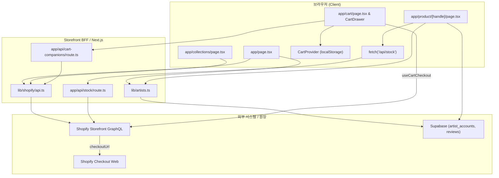

# M04 구매 경험 운영 지도 (Storefront Operations Map)

> 기준일: 2026-09-24 · 대상 모듈: `M04 구매 경험` (`M04-F001 상품 탐색`, `M04-F002 장바구니`)  
> 상태 범례: **[확인한 코드 사실]** / **[코드 수정 완료]** / **[제안]** / **[정책 미결정]** / **[실행하지 않은 검증]**

---

## 1. M04 개요 및 구매자 여정 (R01, B01 → B02 → B05)

M04는 한국 제조 상품 사업 방향 아래 구매자가 Shopify 카탈로그를 탐색하고 구매 결정을 내려 결제로 진입하기까지의 프론트엔드 경험을 담당한다. 카탈로그 쿼리는 제조 국가 속성을 조회하거나 검증하지 않으므로, 화면에 노출된 상품이 한국 제조 상품이라는 조건은 프론트 코드만으로 보장되지 않는다. **[확인한 코드 사실]** / 한국 제조 확인 기준과 카탈로그 등록·검증 책임은 Q01 **[정책 미결정]**.

- **R01 헤드리스 아키텍처 연결**: R01("프론트는 Shopify 헤드리스 프로젝트다")에 따라 Next.js 기반 헤드리스 프론트엔드로 구현되어 있다. Storefront GraphQL API를 통해 카탈로그 탐색(`M04-F001`)과 장바구니/체크아웃 생성(`M04-F002`)을 분리 수행하며, 구매자 여정 B01(발견·탐색) → B02(상세·옵션 확인) → B05(장바구니·Shopify 결제 인계)를 클라이언트에서 책임진다. 단, R01의 "구매 흐름 전체 통합 검증"은 라이브 결제 및 주문 생성까지 수행되지 않은 상태다. **[확인한 코드 사실]** / **[실행하지 않은 검증]**
- **M04-F001 상품 탐색 (B01, B02)**: 홈, 컬렉션, 작가 디렉터리, 상품 상세 화면에서 Shopify에 게시된 상품 카탈로그와 작가 스토리, 옵션/가격/가용성 정보를 제공한다. 상품의 한국 제조 여부를 확인하는 필드나 필터는 [카탈로그 쿼리](../../lib/shopify/queries.ts#L68)에서 확인되지 않았다. Shopify 게시 상태는 관리자 승인이나 한국 제조 확인의 증거가 되지 않는다. **[확인한 코드 사실]**
- **M04-F002 장바구니 (B05)**: 장바구니 담기, 수량/옵션 변경, 장바구니 보관·복원, 쿠폰 적용 후 Shopify Storefront API의 `cartCreate`를 통해 `checkoutUrl`로 이동시킨다.
- **B01 발견·탐색**: 구매자가 [app/page.tsx](../../app/page.tsx) 홈 쉘프, [app/collections/page.tsx](../../app/collections/page.tsx), [app/artists/page.tsx](../../app/artists/page.tsx)를 통해 작품 및 제작 스튜디오를 확인한다.
- **B02 상세·옵션·조건 확인**: [app/product/[handle]/page.tsx](../../app/product/[handle]/page.tsx)에서 옵션을 선택하고 마이크로 캐시(`s-maxage=15, stale-while-revalidate=60`)된 가용 재고([app/api/stock/route.ts](../../app/api/stock/route.ts)), 매장 전체 리뷰(Store Reviews), 배송/반품 정책을 확인한다. (원산지 고정 노출 데이터 경계 및 Etsy 표준 배송·반품 정책 일치화 현황은 [§4.1(5)](#41-핵심-상태-변경에-따른-영향) 참조). **[확인한 코드 사실]**
- **B05 장바구니·결제 이동**: [app/components/CartDrawer.tsx](../../app/components/CartDrawer.tsx) 또는 [app/cart/page.tsx](../../app/cart/page.tsx)에서 주문 내역을 확인하고 결제창으로 이동한다.

---

## 2. 화면별 실제 컴포넌트·데이터 읽기/쓰기 경로



### 2.1 상품 탐색 경로 (M04-F001)
- **홈 화면 (`app/page.tsx`)**:
  - 읽기: [lib/shopify/api.ts](../../lib/shopify/api.ts) `getAllProducts(50)` 호출 → [lib/shopify/storefront.ts](../../lib/shopify/storefront.ts) `storefrontFetch` (GraphQL 2024-01, Next.js ISR `revalidate: 60`).
  - 작가 결합: [lib/artists.ts](../../lib/artists.ts) `getEnrichedArtistsWithProducts` → Supabase `artist_accounts` 조회 결합. **[확인한 코드 사실]**
  - 모드 분기: `isStoreLive()`가 `false`(preview)이면 상단 프리런칭 매니페스토 배너 노출.
- **컬렉션 허브/목록 (`app/collections/page.tsx`, `app/collections/[handle]/page.tsx`)**:
  - 읽기: `getAllProducts(50)` 또는 `getCollectionByHandle(targetHandle)`로 Shopify 카탈로그 조회. 품절 상품을 후순위 정렬. **[확인한 코드 사실]**
- **작가 디렉터리 (`app/artists/page.tsx`, `app/artists/[slug]/page.tsx`)**:
  - 읽기: `getAllProducts(100)` 후 `getEnrichedArtistsWithProducts` 결합. **[확인한 코드 사실]**
- **상품 상세 (`app/product/[handle]/page.tsx`)**:
  - 읽기: `getProductByHandle(handle)`로 상세 정보·이미지·옵션 획득. [app/components/ProductInteractive.tsx](../../app/components/ProductInteractive.tsx)에서 옵션 매트릭스 계산 및 정적 작가 프로필 결합. Supabase `reviews` 테이블에서 상품별 필터(`product_id` 등) 없이 매장 전체의 승인된 리뷰(최신 50건, 5분 ISR 캐시)를 조회해 UI에 "Store Reviews"로 표시하며 단일 상품 JSON-LD에는 미포함(구매자 신뢰 데이터 경계). **[확인한 코드 사실]**
  - 가용 재고 읽기: [app/components/AddToCartSection.tsx](../../app/components/AddToCartSection.tsx)가 클라이언트에서 `fetch('/api/stock?variantId=...')` 호출 → [app/api/stock/route.ts](../../app/api/stock/route.ts)가 Shopify GraphQL (2025-10, `next: { revalidate: 15 }`)로 `quantityAvailable`, `currentlyNotInStock` 수신. 응답 헤더가 `Cache-Control: public, s-maxage=15, stale-while-revalidate=60`을 설정하므로 백그라운드 재검증 중 stale 데이터가 제공될 수 있어 지연이 15초를 초과할 수 있으며, 15초를 최대 지연 시간으로 보장하지 않고 실시간성도 보장하지 않음. **[확인한 코드 사실]**

### 2.2 장바구니 및 결제 진입 경로 (M04-F002)
- **장바구니 상태 관리 (`app/components/CartProvider.tsx`)**:
  - 쓰기/읽기: 브라우저 `localStorage`의 `blank-seoul-cart` 키 사용. React 19 `useSyncExternalStore`([lib/hooks/useStoredValue.ts](../../lib/hooks/useStoredValue.ts))를 통해 탭·컴포넌트 간 동기화. **[확인한 코드 사실]**
  - 아이템 추가: [app/components/BuyButton.tsx](../../app/components/BuyButton.tsx) 클릭 시 `addToCart` 호출.
- **결제 실행 (`app/cart/_hooks/useCartCheckout.ts`)**:
  - 실행 조건: `isStoreLive()`가 `true`이고 장바구니 아이템이 1개 이상일 때만 동작. preview 모드에서는 결제 버튼 대신 [app/components/PrelaunchWaitlistCard.tsx](../../app/components/PrelaunchWaitlistCard.tsx) 대기열 등록 폼 렌더링. **[확인한 코드 사실]**
  - 백업 쓰기: 결제 직전 `backupToStorageOnly`가 호출되어 `blank-seoul-checkout-backup`에 1시간 만료 백업을 저장하고 `blank-seoul-cart` 본체는 비움. **[확인한 코드 사실]**
  - Shopify 결제 생성: `storefrontFetch(CREATE_CART)` 호출 → `cartCreate(lines, discountCodes)` mutation 실행 → 반환된 `cart.checkoutUrl`로 `window.location.href` 리다이렉트. `userErrors` 발생 시 `setError(userErrors[0].message)` 후 이동 차단 처리 존재. **[확인한 코드 사실]**

---

## 3. 외부 모듈 인터페이스 및 계약 책임 경계

| 계약 / 모듈 | 생산자 → 소비자 | M04 수신 방식 및 실제 동작 | 책임 경계 및 차이점 |
|---|---|---|---|
| **C02 상품 판매 준비** | M03/M02 → Shopify → M04 | Shopify GraphQL 쿼리를 통해 Shopify 카탈로그에 게시된(published) 상품만 수신 ([lib/shopify/api.ts](../../lib/shopify/api.ts)). | M04는 Admin 승인 상태나 한국 제조 여부를 직접 조회하지 않음. Shopify 게시 상태는 관리자 승인이나 한국 제조 확인의 증거가 되지 않으며, 오직 카탈로그 노출 기준으로만 소비함. **[확인한 코드 사실]** (한국 제조 확인 기준은 Q01 **[정책 미결정]**, 상품 승인은 M03 책임) |
| **C03 판매량·가격 반영** | M03 → M11 → Shopify → M04 | 1차: ISR 60초 캐시된 카탈로그 가격/옵션 표시. 2차: PDP에서 [app/api/stock/route.ts](../../app/api/stock/route.ts)로 마이크로 캐시(`s-maxage=15, stale-while-revalidate=60`) 잔여 수량 수신. | M04는 물류 실물 재고나 작가 설정 원장(`master_products`)을 직접 읽지 않고 Shopify 동기화 결과만 소비. stale-while-revalidate로 인해 지연이 15초를 초과할 수 있어 15초 최대 지연을 보장하지 않으며 완벽한 실시간성도 보장하지 않음. 가격/수량 경합 시 최종 결제 금액과 구매 가능 여부는 Shopify Checkout이 결정하나 실제 연동 검증은 미실행. **[확인한 코드 사실]** / **[실행하지 않은 검증]** (우선순위 Q05 **[정책 미결정]**) |
| **C06 출고·고객 표시** | M06 → M07 → Shopify/M05 → M04/구매자 | M04 자체는 결제 후 화면을 다루지 않으며, M05 [app/api/orders/route.ts](../../app/api/orders/route.ts)가 주문 상태 및 분할 패키지 추적을 전담 ([app/components/OrderPackageCard.tsx](../../app/components/OrderPackageCard.tsx)). | M04의 책임은 `checkoutUrl` 인계에서 종료. 결제 완료 이후 주문 추적과 배송 패키지 표시는 M05의 책임임. **[확인한 코드 사실]** |
| **M01 계정 인증 경계** | M01 (Supabase Auth) ↔ M04 | 탐색과 장바구니 조작은 비로그인(게스트) 상태로 허용. [app/cart/page.tsx](../../app/cart/page.tsx)의 보유 쿠폰 조회(`/api/my-coupons`) 시에만 로그인 이메일 검증. | 장바구니는 사용자 계정이 아닌 브라우저 localStorage에 귀속됨. 계정 전환 시 장바구니 자동 병합 메커니즘 없음. **[확인한 코드 사실]** |
| **M03 상품·판매량 경계** | M03 (Admin 상품 원장) → M04 | M03이 `master_products`에 등록하고 Shopify에 동기화한 카탈로그를 M04가 읽기 전용으로 소비. | M04는 상품 원장이나 재고를 변경할 수 없으며, 메타데이터 누락 시 프론트 자체 보정 불가. **[확인한 코드 사실]** |
| **M05 주문 관리 경계** | M04 (`checkoutUrl`) → Shopify → M05 | M04는 결제창 URL로 구매자를 이동시키며, 결제 성공 후 Shopify 주문 웹훅 수신 및 주문 레코드 생성은 M05가 담당. | M04는 결제 완료 여부를 직접 수신하거나 인지하지 못함. **[확인한 코드 사실]** |

---

## 4. 변경 영향 분석 및 인접 기능 검토

### 4.1 핵심 상태 변경에 따른 영향
1. **카탈로그 상품 및 작가 공개 정보 변경**:
   - 영향: ISR 60초 캐시 만료 전까지 이전 상품명·가격이 노출될 수 있음. Admin에서 작가명 변경 시 Shopify vendor 태그와 [lib/artists.ts](../../lib/artists.ts)의 `VENDOR_TO_SLUG_MAP` 불일치로 작가 프로필 연결이 분리될 위험 존재. **[확인한 코드 사실]** (개명 및 프로필 처리 정책 Q03 **[정책 미결정]**)
2. **옵션 및 재고 변경 (품절 발생)**:
   - 상세 페이지 영향: 카탈로그 상 `availableForSale`이 true여도 상세 페이지의 `/api/stock` 호출 결과 가용량이 0이면 [app/components/AddToCartSection.tsx](../../app/components/AddToCartSection.tsx)에서 담기 버튼이 즉시 비활성화됨. 단, `/api/stock`은 `next: { revalidate: 15 }` 및 `s-maxage=15, stale-while-revalidate=60`이 적용되어 캐시 만료 후 재검증 동안 stale 응답이 제공될 수 있으므로 변경 반영 지연이 15초를 넘길 수 있으며 15초 최대 지연을 보장하지 않음. **[확인한 코드 사실]**
   - 이미 담긴 장바구니 영향: 장바구니 페이지 진입 시 재고 재검증 로직이 없음 **[확인한 코드 사실]**. 결제 시 `userErrors` 발생 시 이동을 차단하는 코드는 존재하나([app/cart/_hooks/useCartCheckout.ts#L56](../../app/cart/_hooks/useCartCheckout.ts#L56)), Shopify `cartCreate`가 품절 상황에서 실제로 `userErrors`를 반환하고 결제를 막는지 및 최종 결제 금액 반영은 라이브 연동에서 검증되지 않음. **[실행하지 않은 검증]** (재고 우선순위 정책 Q05 **[정책 미결정]**)
3. **쿠폰 코드 적용**:
   - 영향: [app/cart/_components/CartCouponDrawer.tsx](../../app/cart/_components/CartCouponDrawer.tsx)에서 쿠폰 적용 시 `CREATE_CART`의 `discountCodes` 배열로 전달됨. `useCartCheckout.ts#L56`에 `userErrors` 수신 시 중단 로직이 구현되어 있으나, 잘못되거나 만료된 쿠폰 입력 시 Shopify API가 실제로 `userErrors`를 반환하여 결제를 차단하는지는 라이브 연동에서 검증되지 않음. **[확인한 코드 사실]** (코드 핸들러) / **[실행하지 않은 검증]** (Shopify 실제 오류 반환)
4. **`cartCreate` 호출 및 `checkoutUrl` 이동**:
   - 영향: `window.location.href`로 외부 도메인(Shopify) 이동. 이동 직전 로컬스토리지 백업이 저장되고 카트 본체는 삭제됨. **[확인한 코드 사실]**
5. **원산지 및 배송·반품 정책 데이터 경계 (B02)**:
   - 원산지 표시: [app/product/[handle]/page.tsx#L110](../../app/product/[handle]/page.tsx#L110)의 JSON-LD는 `countryOfOrigin: South Korea`로 고정되어 있으나, 카탈로그 쿼리는 제조국 속성을 검증하지 않으므로 Q01의 정책 미결정 사항이 확정 정보로 노출되는 불일치 공백이 존재함. **[확인한 코드 사실]**
   - 배송·반품 일치화: 상품 상세 JSON-LD, PDP UI 팝오버([ProductTrustAccordions.tsx](../../app/components/ProductTrustAccordions.tsx)), 반품 정책([returns/page.tsx](../../app/policies/returns/page.tsx)), 배송 정책([shipping/page.tsx](../../app/policies/shipping/page.tsx)) 및 FAQ([FAQ.tsx](../../app/components/FAQ.tsx)) 간의 정책 불일치를 Etsy 표준 모델(7~14 영업일 배송 `transitTime: 7-14d`, 30일 이내 반품 접수 가능하되 단순 변심 반송비 구매자 부담 `ReturnFeesCustomerResponsibility`, 파손/불량 100% 무반송 보증)로 일치화 완료함. **[코드 수정 완료 — 2026-09-24]**

### 4.2 Preview vs Live 모드 분기 분석
- **코드 분기 사실**: [lib/constants.ts](../../lib/constants.ts) `STORE_LAUNCH_STATUS`에 따라 결정.
  - `preview`: 구매 차단. 홈 배너 노출, PDP 버튼 "Add to Launch Bag" 변경, 장바구니에서 결제 버튼 대신 이메일 대기열 폼([app/components/PrelaunchWaitlistCard.tsx](../../app/components/PrelaunchWaitlistCard.tsx)) 렌더링.
  - `live`: 정식 결제 활성화. 표준 체크아웃 플로우 동작. **[확인한 코드 사실]**
- **운영 확인 과제**: 로컬 기본값은 `"preview"`이며, 실제 프로덕션 Vercel 환경변수(`NEXT_PUBLIC_STORE_LAUNCH_STATUS`)의 live 설정 여부는 운영 환경 대조가 필요함. **[실행하지 않은 검증]** (Q01 출시 형태 **[정책 미결정]**)

---

## 5. 대표 검증 시나리오 및 운영 관측 신호

### 5.1 대표 시나리오 (조건, 기대 결과, 확인 상태, 확인 위치/증상)
1. **정상 구매 진입 (R01, B01 → B02 → B05)**:
   - 조건: Live 모드에서 구매자가 홈/컬렉션 상품 선택 후 PDP에서 옵션 선택, 장바구니 담기, "Proceed to Checkout" 클릭.
   - 기대 결과: [app/components/AddToCartSection.tsx](../../app/components/AddToCartSection.tsx)에서 가용 재고 확인(`/api/stock` 마이크로 캐시) → 장바구니 추가 → [app/cart/_hooks/useCartCheckout.ts](../../app/cart/_hooks/useCartCheckout.ts)의 `cartCreate` 성공 후 반환된 `checkoutUrl`로 리다이렉트.
   - 상태: 클라이언트 컴포넌트/훅 호출 연결은 **[확인한 코드 사실]**, 실제 결제창 랜딩, 최종 금액 일치 및 결제 완료까지의 E2E 흐름은 **[실행하지 않은 검증]**.
   - 변경·장애 시 확인할 위치 및 증상:
     - 증상: 장바구니에서 결제 버튼 미동작 또는 에러 모달 발생.
     - 위치: [lib/constants.ts](../../lib/constants.ts) (`isStoreLive`), [lib/shopify/storefront.ts](../../lib/shopify/storefront.ts) (인증/엔드포인트), [app/cart/_hooks/useCartCheckout.ts](../../app/cart/_hooks/useCartCheckout.ts) (`userErrors`).
2. **목록 오류 vs 실제 빈 목록 (Shopify API 장애 vs 카탈로그 0건)**:
   - 조건 A (Shopify API 장애): Storefront API 인증 오류 또는 네트워크 장애 발생.
     - 기대 결과: `getAllProducts` 경로는 [lib/shopify/api.ts#L120](../../lib/shopify/api.ts#L120)에서 서버 콘솔에 오류를 기록하고 빈 배열 `[]`을 반환한다. 홈은 상품 쉘프를 숨기지만 Supabase 조회가 성공하면 작가 영역은 남을 수 있고, `/collections` 허브는 준비 중 빈 상태를 표시한다. `/artists`도 [lib/artists.ts#L191](../../lib/artists.ts#L191)의 DB 작가 결합 결과를 표시할 수 있다. 개별 `/collections/[handle]` 조회가 실패해 `null`이면 [해당 페이지](../../app/collections/[handle]/page.tsx#L160)는 `notFound()`로 404를 표시한다.
     - 상태: 경로마다 장애 결과가 다르며 `getAllProducts` 소비 화면에서는 500을 피하는 대신 상품 장애가 정상 빈 목록처럼 보일 수 있다. 코드 동작과 서버 로그는 **[확인한 코드 사실]**, 원격 경보 연결은 **[실행하지 않은 검증]**.
     - 장애 시 확인할 위치 및 증상:
       - 증상: 사이트 에러 500 없이 상품 그리드만 텅 빈 화면 노출, 또는 개별 컬렉션 404.
       - 위치: [lib/shopify/api.ts](../../lib/shopify/api.ts) `getAllProducts` catch 블록, Vercel Function 로그 `[getAllProducts]`.
   - 조건 B (실제 빈 카탈로그): Shopify 카탈로그에 상품이 0건 등록된 정상 상태.
     - 기대 결과: `getAllProducts`를 쓰는 홈과 `/collections` 허브의 상품 결과는 조건 A와 같지만, `/artists`는 Supabase에 등록된 작가를 계속 표시할 수 있다. 개별 컬렉션은 별도 `getCollectionByHandle` 결과에 따라 빈 컬렉션 화면 또는 404가 된다.
     - 상태: `getAllProducts` 소비 화면은 반환값만으로 API 장애와 실제 빈 목록을 구분하지 못한다. **[확인한 코드 사실]** / 사용자 화면과 원격 관측에서 원인을 구분하는 기능은 **[제안]**.
3. **가격 변경 및 품절 변경 경합 (Price Change & Out-of-Stock Race Condition)**:
   - 조건 A (가격 변경): 장바구니 담은 후 결제 전 Admin/Shopify에서 상품 가격이 변경된 경우.
     - 기대 결과: M04 장바구니는 담긴 시점의 로컬 가격을 표시하지만, `cartCreate` 호출 시에는 `merchandiseId`와 `quantity`만 전송하므로([app/cart/_hooks/useCartCheckout.ts#L44-L47](../../app/cart/_hooks/useCartCheckout.ts#L44-L47)) 최종 결제창에서는 Shopify 최신 가격이 적용되어야 함.
     - 상태: 카트 내 가격 재검증 없이 variantId만 전송하는 코드는 **[확인한 코드 사실]**, 결제창 최종 금액 변동 시 구매자 고지 정합성 및 실제 반영 여부는 **[실행하지 않은 검증]**.
   - 조건 B (품절 변경 경합): 장바구니 보관 중 타인 구매로 품절 발생.
     - 기대 결과: `useCartCheckout`에서 `cartCreate` 호출 시 Shopify가 `userErrors`를 반환하면 에러 메시지 표시 후 결제 이동 중단.
     - 상태: [useCartCheckout.ts#L56-L59](../../app/cart/_hooks/useCartCheckout.ts#L56-L59)에 `userErrors` 핸들러가 존재하는 것은 **[확인한 코드 사실]**, Shopify API가 실제로 품절 상황에서 `userErrors`를 반환하고 결제를 차단하는지는 **[실행하지 않은 검증]** (Q05 **[정책 미결정]**).
   - 장애/경합 시 확인할 위치 및 증상:
     - 증상: 장바구니 표시 금액과 Shopify 체크아웃 금액 불일치, 또는 결제 버튼 클릭 시 오류 메시지 표시.
     - 위치: [app/cart/_hooks/useCartCheckout.ts](../../app/cart/_hooks/useCartCheckout.ts), Shopify 카탈로그 단가.
4. **장바구니 복원 (Cart Abandonment Recovery)**:
   - 조건: 체크아웃 이동 후 결제 미완료 상태에서 1시간 이내에 `/cart` 재방문.
   - 기대 결과: 로컬스토리지 `blank-seoul-checkout-backup`이 감지되어 [app/cart/_components/CartBackupModal.tsx](../../app/cart/_components/CartBackupModal.tsx) 팝업 노출 → "Restore My Cart" 클릭 시 기존 상품 복원.
   - 상태: 백업 저장 및 모달 복원 코드는 **[확인한 코드 사실]**, 세션 만료 및 실제 사용자 복원 E2E는 **[실행하지 않은 검증]**.
   - 장애 시 확인할 위치 및 증상:
     - 증상: 결제창 이탈 후 재방문 시 장바구니가 비어 있고 복원 모달이 뜨지 않음.
     - 위치: [app/components/CartProvider.tsx](../../app/components/CartProvider.tsx) (`BACKUP_STORAGE_KEY`, 1시간 만료 체크), 브라우저 localStorage.
5. **Shopify userErrors 및 결제 중단 (Checkout Failure & Interruption)**:
   - 조건 A (잘못된 쿠폰 / API 오류): 만료·잘못된 쿠폰 입력 또는 필수 필드 누락으로 `cartCreate` 응답에 `userErrors` 반환.
     - 기대 결과: [useCartCheckout.ts#L56](../../app/cart/_hooks/useCartCheckout.ts#L56)에서 첫 번째 에러 메시지를 `error` 상태에 설정하고 리다이렉트 중단.
     - 상태: 에러 핸들링 코드는 **[확인한 코드 사실]**, 쿠폰/필드 오류 시 Shopify 실제 반환 스펙 검증은 **[실행하지 않은 검증]**.
   - 조건 B (결제 중단 / 네트워크 오류): 결제 API 호출 중 네트워크 단절 또는 브라우저 창 이탈.
     - 기대 결과: 네트워크 실패 시 `useCartCheckout.ts#L69` catch 블록에서 `isRedirecting: false`로 롤백하고 에러 표시. 결제창 이동 후 이탈 시에는 장바구니 본체는 비워져 있고 백업만 유지됨.
     - 상태: 예외 catch 처리는 **[확인한 코드 사실]**, 결제 이탈 후 전환율 및 재시도 UX 검증은 **[실행하지 않은 검증]**.
   - 장애 시 확인할 위치 및 증상:
     - 증상: 결제 버튼 클릭 시 리다이렉트되지 않고 상단에 붉은색 에러 텍스트 표시.
     - 위치: [app/cart/_hooks/useCartCheckout.ts](../../app/cart/_hooks/useCartCheckout.ts), [app/cart/_components/CartCouponDrawer.tsx](../../app/cart/_components/CartCouponDrawer.tsx).
6. **주문 및 배송 상태 고객 표시 (C06, M05/M07 경계)**:
   - 조건: 결제 완료 후 고객이 내 계정 주문 목록([app/account/page.tsx](../../app/account/page.tsx))에 접근.
   - 기대 결과: M04의 책임은 `checkoutUrl` 이동으로 종료되며, 결제 이후 주문·배송 상태 표시는 M05 [app/api/orders/route.ts](../../app/api/orders/route.ts)가 전담. Shopify 주문 데이터와 Supabase `artist_orders`/물류 상태를 결합하여 [app/components/OrderPackageCard.tsx](../../app/components/OrderPackageCard.tsx)에 분할 패키지 및 배송 진행률 표시.
   - 상태: M04와 M05의 경계 분리 및 API/컴포넌트 구현은 **[확인한 코드 사실]**, 다중 작가 합포장/분할 출고 및 17Track 송장 추적의 정확한 고객 화면 표시는 **[실행하지 않은 검증]**.
   - 장애 시 확인할 위치 및 증상:
     - 증상: 결제 완료 후 내 계정에서 주문이 보이지 않거나 배송 상태 단계 오표기.
     - 위치: [app/api/orders/route.ts](../../app/api/orders/route.ts), [app/components/OrderPackageCard.tsx](../../app/components/OrderPackageCard.tsx).

### 5.2 운영 관측 신호 (Observability)
- **현재 코드에서 확인한 신호**: [lib/shopify/api.ts](../../lib/shopify/api.ts)는 Shopify 조회 실패를 서버 `console.error`에 기록하고, [lib/artists.ts](../../lib/artists.ts)는 Supabase 작가 조회 실패를 서버 `console.warn`에 기록한다. [app/components/AddToCartSection.tsx](../../app/components/AddToCartSection.tsx)는 재고 조회 실패를 브라우저 `console.error`에 기록한다. **[확인한 코드 사실]**
- **확인하지 못한 운영 연결**: 이 콘솔 로그가 Vercel 로그 보존, 원격 텔레메트리 또는 호출 가능한 경보로 연결되는지는 저장소 코드만으로 확인하지 못했다. **[실행하지 않은 검증]**
- **운영에 필요한 필수 관측 지표 제안**:
  1. `storefront_api_failure_rate`: Shopify Storefront API 호출 실패율 (빈 목록 은폐 감지). **[제안]**
  2. `cart_create_user_errors`: 품절/쿠폰 오류 발생 건수 및 사유 집계. **[제안]**
  3. `checkout_redirect_rate`: 장바구니 진입 대비 Shopify checkoutUrl 리다이렉트 성공률. **[제안]**
  4. `cart_restore_action_count`: 결제 이탈 후 복원 모달 수락/거절 비율. **[제안]**
  5. `return_request_rate`: 전체 주문 건수 대비 반품/교환 문의율 및 귀책 사유별(단순변심 vs 파손/불량) 비중 집계 (Etsy형 반품 정책 전환 후 구매자 마찰 및 정산 영향 추적). **[제안]**

---

## 6. 근거가 있는 정리 후보(제안) 및 모듈 기록 템플릿

### 6.1 조사 출발점 4대 정리 후보 분석
1. **`getAllProducts` 호출 화면의 50/100개 단일 페이지 제한**:
   - 근거: [app/page.tsx](../../app/page.tsx) 홈 쉘프(50), [app/collections/page.tsx](../../app/collections/page.tsx) 허브(50), [app/collections/[handle]/page.tsx](../../app/collections/[handle]/page.tsx#L71) 슈퍼 카테고리 허브(50), [app/artists/page.tsx](../../app/artists/page.tsx)(100), [app/artists/[slug]/page.tsx](../../app/artists/[slug]/page.tsx#L44) 작가 상세 작품 목록(100), [app/api/cart-companions/route.ts](../../app/api/cart-companions/route.ts#L52) 장바구니 추천 API(50)가 `getAllProducts(count)`를 호출. [lib/shopify/api.ts#L116](../../lib/shopify/api.ts#L116)은 커서 페이지네이션 없이 단일 페이지만 반환함.
   - 영향: 전체 시스템에서 상품이 영구 누락되는 것은 아니며, [개별 컬렉션 화면](../../app/collections/[handle]/page.tsx#L156)은 별도 조회(`getCollectionByHandle`)를 사용해 최대 250개 상품을 조회하고 [상품 상세](../../app/product/[handle]/page.tsx)도 핸들로 직접 조회 가능함. 그러나 `getAllProducts`를 사용하는 홈 쉘프·컬렉션 허브·슈퍼 카테고리뿐만 아니라, [작가 상세](../../app/artists/[slug]/page.tsx#L44)의 전체 작품 목록(101번째 이후 작품 누락) 및 [장바구니 추천](../../app/api/cart-companions/route.ts#L52)(51번째 이후 추천 후보 누락)에서도 초기 노출 대상에서 제외되는 누락 위험이 존재함.
   - 제안: [lib/shopify/api.ts#L74](../../lib/shopify/api.ts#L74)에 이미 구현된 커서 페이지네이션 함수 `fetchAllCatalogProducts`를 활용하거나 화면별 서버 페이징 도입. **[제안]** (정책 의존성: 카탈로그 목표 규모 및 캐시 비용).
2. **Shopify 조회 실패 시 빈 목록 조용히 반환**:
   - 근거: [lib/shopify/api.ts#L122](../../lib/shopify/api.ts#L122) `catch (error) { return []; }`.
   - 영향: API 토큰 만료나 Shopify 장애 시 전체 사이트가 조용히 "준비 중/상품 없음" 빈 화면으로 렌더링되어 ISR 캐시로 고착화될 위험.
   - 제안: 카탈로그 페치 실패 시 정적 빈 배열 대신 Sentry/에러 로그 전송 및 Next.js 에러 바운더리 활성화, ISR 재시도 설정 보완. **[제안]**
3. **작가 이름·slug 결합과 상품 없는 DB 작가 노출**:
   - 근거: [lib/artists.ts#L25-L51](../../lib/artists.ts#L25-L51) `VENDOR_TO_SLUG_MAP` 정적 하드코딩. [lib/artists.ts#L195-L231](../../lib/artists.ts#L195-L231)에서 Supabase `artist_accounts` 조회 시 승인 상태 필터를 읽지 않으며, 상품이 0개(`worksCount: 0`)인 DB 작가 계정도 목록에 무조건 추가함. **[확인한 코드 사실]**
   - 영향: 등록 작품이 0개인 DB 작가가 `/artists` 디렉터리에 그대로 노출되어 상세 진입 시 빈 작품 목록이 표시됨 (작가 승인 상태는 조회 코드상 미확인). 또한 작가 개명 시 `VENDOR_TO_SLUG_MAP` 불일치로 매핑이 단절될 위험 존재.
   - 제안: `worksCount > 0`인 작가만 공개 디렉터리에 노출하는 필터링 조건 추가 및 DB 불변 식별자 연동. **[제안]** (주의: 상품 없는 작가의 공개 여부는 정책 및 인접 여정에 영향이 있는 제안이며, 확정된 변경 규칙이 아님 — Q03 **[정책 미결정]**).
4. **장바구니 백업·복원 경로의 결제 완료 인지 결핍**:
   - 근거: [app/cart/_hooks/useCartCheckout.ts#L65](../../app/cart/_hooks/useCartCheckout.ts#L65) 리다이렉트 시 무조건 카트 삭제 후 백업 저장. 완료 콜백 없음.
   - 영향: 결제 완료 고객이 장바구니 재방문 시 결제 상품 복원 유도 혼선.
   - 제안: 주문 감사 페이지 또는 계정 주문 페이지([app/account/page.tsx](../../app/account/page.tsx)) 진입 시 `blank-seoul-checkout-backup`을 명시적으로 파기하는 훅 연동. **[제안]** (주의: 장바구니 백업 삭제 시점은 구매자 재방문 경험 및 결제 확인 시점에 영향을 주는 제안이며, 확정된 변경 규칙이 아님).

### 6.2 재사용 가능한 모듈 기록 템플릿 (M01–M12 공통)
```markdown
# [M00 모듈명] 운영 지도
## 1. 개요 및 사용자 여정 (역할 및 단계 연결)
- 주관 기능 ID, 요구사항 ID(R00), 여정 단계, 제공하는 사용자 가치
## 2. 화면 및 실제 읽기·쓰기 경로
- 화면/진입점 → 컴포넌트/훅 → BFF/서비스 → DB/외부 시스템
## 3. 외부 인터페이스 및 모듈 계약 (C00 연결)
- 데이터 생산자/소비자 관계, 책임 경계, 전이 조건
## 4. 변경 영향 분석 및 인접 기능 검토
- 상태 변경 전파, 모드 분기(운영 vs 로컬), 결합도
## 5. 대표 검증 시나리오 및 운영 관측 신호
- 조건, 기대 결과, 확인 상태([코드 사실] vs [미실행 검증])
- 정상/실패 시나리오, 오류 증상, 모니터링 메트릭 제안
## 6. 코드 정리 후보 및 정책 의존 사항
- 코드 사실 근거, 개선 제안, 사업 정책 질문(Q00) 연결
```
